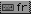
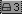

# i3Blocks Gate 

my i3blocks Scripts For Ubuntu More Simple and More useful (Arch Linux Soon)

| i3blocks Script |  Screen Shot |
|-----------------|--------------|
| Blocks.sh 1     | 
| Blocks.sh 2     | 
| Blocks.sh 3     | 
| Blocks.sh 4     | 
| Blocks.sh 5     | 
| Blocks.sh 6     | 
| Blocks.sh 7     | 
| Blocks.sh 8     | 
| Blocks.sh 9     | 
| Blocks.sh 10    | 
| Blocks.sh 11    | 
| Blocks.sh 12    | 
| Blocks.sh 13    | 
| Blocks.sh 14    | 
| Blocks.sh 15    | 
| Blocks.sh 16    | 
| Blocks.sh 17    | 
| Blocks.sh 18    | 
| Blocks.sh 19    | 
| Blocks.sh 20    | 
| Blocks.sh 21    | 
| Blocks.sh 22    | 
| Blocks.sh 23    | 
| Blocks.sh 24    | 
| Blocks.sh 25    | 
| Blocks.sh 26    | 
| Blocks.sh 27    | 
| Blocks.sh 28    | 
| Blocks.sh 29    | 
| Blocks.sh 30    | 
| Blocks.sh 31    | 

---
## Help Dialog
```
blocks : Simple script Collection for i3blocks 

        Utils : 
            (1)  :
                -  Show CPU Info * Deps : (Mpstat)
                    usage : blocks 1 "$ICON"
            (2)  :
                -  Show Multi Cpu Info * Deps : (Mpstat)
                    usage : blocks 2 "$ICON"
            (3)  :
                -  Show Memory Usage * Deps : (Free)
                    usage : blocks 3 "$ICON"
            (4)  :
                -  Show Swap Usage * Deps : (Free)
                    usage : blocks 4 "$ICON"
            (5)  :
                -  Show Date and Time * Deps : (Date)
                    usage : blocks 5 "$ICON"
            (6)  :
                -  Show Battery Status * Deps : (acpi)
                    usage : blocks 6  ( You can't change battery icon )
            (7)  :
                -  Show Disk Usage * Deps : (df)
                    usage : blocks 7 "$PARTITION" "$ICON" 
                    example : blocks 7 "/home" ""
            (8)  :
                -  Show Keyboard Layout
                    usage : blocks 8 "$ICON"
            (9)  :
                -  Show System language
                    usage : blocks 9 "$ICON"
            (10) :
                -  Show Machine Uptime * Deps : (uptime)
                    usage : blocks 10 "$ICON"
            (11) :
                -  Show Trash Size * Deps : (du)
		    usage : blocks 11 "$ICON"
            (12) :
	        -  Show Window Usage * Deps : (xdotool)
		    usage : blocks 12 "$ICON"
            (13) :
	        -  Show Mocp playing song and status * Deps : (moc)
		    usage : blocks 13 "$ICON"
            (14) :
	        -  Show mpd Playing song and status * Deps : (mpd; ncmpccp, mpc)
		    usage : blocks 14 "$ICON"
            (15) :
	        -  Show Cpu Temp * Deps : (xsenser)
		    usage : blocks 15 "$ICON"
            (16) :
	        -  Show Gpu Temp * Deps : (xsenser)
		    usage : blocks 16 "$ICON"
            (17) :
	        -  Show Touchpad status * Deps : (sysclient)
		    usage : blocks 17 "$ICON"
            (18) :
	        -  Show Volume Status * Deps : (alsa)
		     usage : blocks 18  ( You can't change battery icon )
            (19) :
	        -  Show Wifi info ; ip ; connected name * Deps : (ifconfig; nmcli)
		     usage : blocks 19 "$ICON
            (20) :
	        -  Show Ethernet info ; ip ; connected name *Deps : (ifconfig; nmcli)
		     usage : blocks 20 "$ICON"
            (21) :
	        -  Show prosses use by this User * Deps : (ps)
		     usage : blocks 21 "$ICON"
            (22) :
	        -  Show System Kerenel * Deps : (uname)
		     usage : blocks 22 "$ICON"
            (23) :
	        -  Show Usb Plug in your Computer * Deps : (lsblk)
		     usage : blocks 23 "$ICON"
            (24) :
	        -  Show Total pkgs install in your system * Deps : (dpkg)
		     usage : blocks 24 "$ICON"
            (25) :
	        -  Check if there is any Update in your system * Deps : (apt-get)
		    usage : blocks 25 "$ICON"
		    Configuration :
		        If you want auto check update you can add this line to "/etc/rc.local" file before **exit 0**
			```sudo apt-get -q update```` **I'm not responsible for any damage happen to your system**
            (26) :
	        -  Show ufw Status
		    usage : blocks 26 "$ICON"
            (27) :
	        -  Show number lock status * Deps : (xset)
		    usage : blocks 27 "$ICON"
            (28) :
	        -  Show Bluetooth Status 
		    usage : blocks 28 "$ICON"
            (29) :
	        -  Show Caps Lock Status * Deps : (xset)
		    usage : blocks 29 "$ICON"
            (30) :
	        -  Show X screensaver status
		    usage : blocks 30 "$ICON"
            (31) :
	        -  Calculate Mount Points on System 
		    usage : blocks 31 "$ICON"
             (-h): 
                - Show this help message 
```
---

### What's New 

* Give You Access to change Icons with text or any other symbol 
* Add new script to show more information about your System 
* ALL-IN-ONE Gather All the Scripts in one place for easy Access 
* Add Help Dialog to Give You Information You need to know 

---

### Installation 

```bash 
git clone https://github.com/zakariaGatter/i3blocks-gate ~/.config/i3blocks/Blocks 
```

### Configuration 

##### configuration
```sh
[Bat]
command=~/.config/i3blocks/Blocks/Ubuntu/block.sh [1-31]
interval=5
color=#XXXXXX
```

### Support 

[Fiverr](https://www.fiverr.com/zakariagatter)

[Donate](https://www.paypal.me/ZGatter)


### [!] NOTE :
- In some cases you need install the icons:
  - Ubuntu
  ```sh
  apt-get install fonts-font-awesome lm-senser alsa-utils acpi xdotool mpd mpc ncmpcpp moc sysstat
  ```
